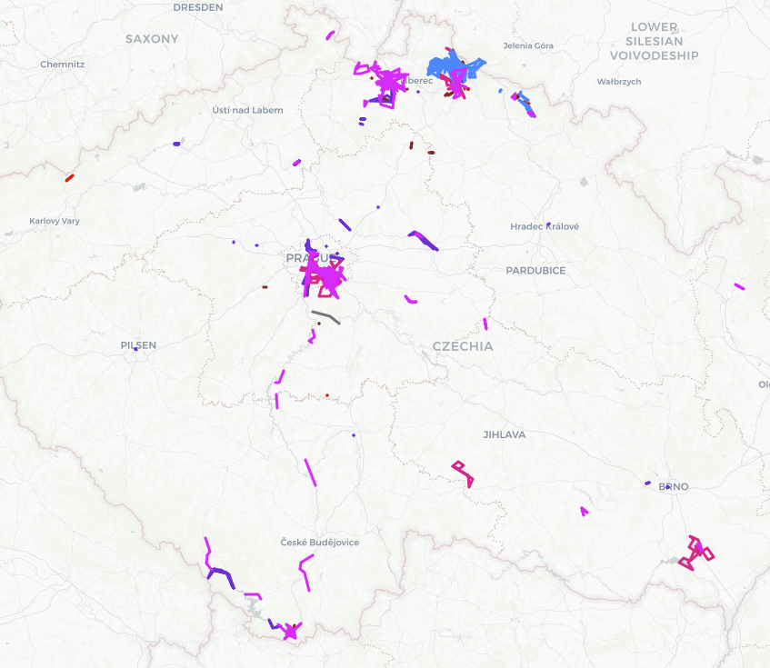
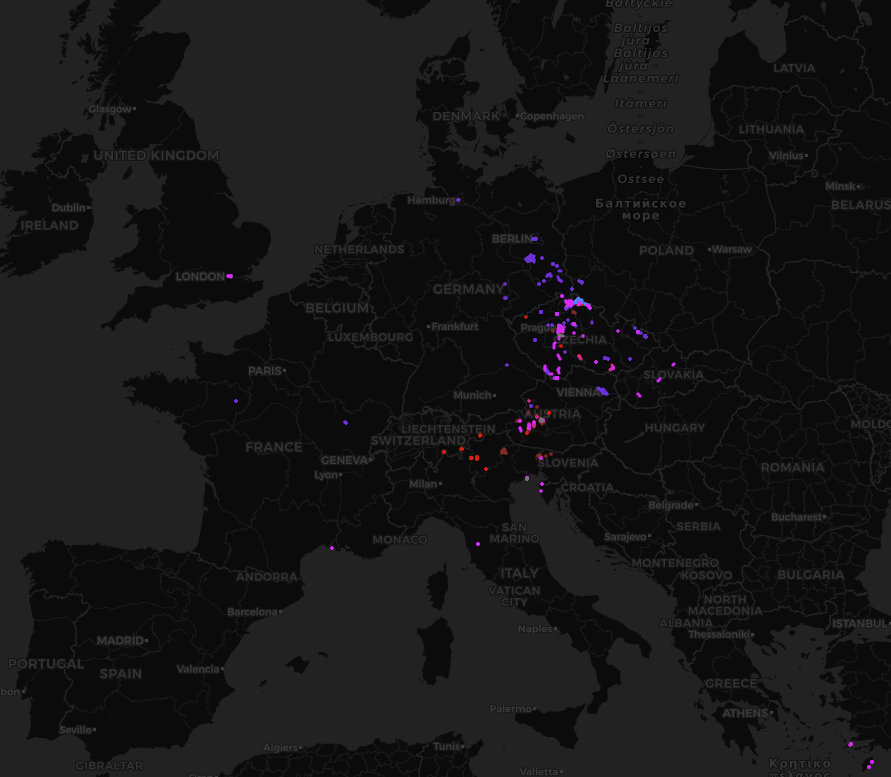
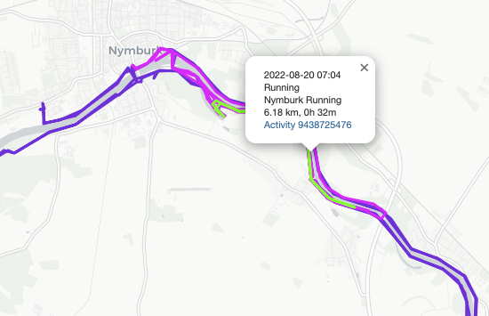
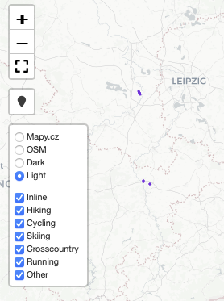

<h1>Garmin Activities Map</h1>

Tool to render Garmin activities on a map. It downloads activities from Garmin Connect, stores them locally, generates an HTML file
with all the activities shown on an interactive map and optionally uploads it to an FTP site. It gives you an easy-to-understand overview of
where you were, which paths you visited and which are still waiting for you.

It is a tool not an application. A couple of steps are needed to make it work and some code adjustments may be required to match
your needs.

It should be useful primarily for people using Garmin Connect as the main repository of their activities. If you use Strava, I would recommend
to look into [StatsHunters](https://www.statshunters.com), which is a more mature and feature-rich application.

<h2>What it produces</h2>
Example with a light background map:

Example with a dark background map:

Hovering over an activity highlights it. Clicking an activity opens a popup with basic information about the activity and a link to Garmin
Connect:

Map controls allow for selection of background map, selection of activity categories to show and for zooming in/out:

<h2>How to get it working</h2>
- install Python 3
- currently requires custom fork of python-garminconnect to make it work
  - https://github.com/MareenCZE/python-garminconnect
  - check it out to your environment and run: "pip install -e ."
- get python dependencies from requirements.txt
- create `.auth` directory
  - only if you want to upload the result to an FTP site:
    - create `.auth/ftp_config.json` similar to following
    - <pre>{
        "host": "ftp.mysite.com",
        "user": "myFtpUser",
        "pass": "myFtpPassword",
        "remotePath": "/www/sport",
        "remoteFilename": "index.html"
      }</pre>
  - only if you want to use Mapy.cz map tiles (useful mostly for tourist paths in Central Europe region):
    - go to https://developer.mapy.cz/en/rest-api-mapy-cz/api-key/
    - generate your own API key
    - store the key as `.auth/mapy_cz_api_key.txt`
- set coordinates of desired center point of the map in create_map method in mapgenerator.py (default is Prague, Czech Republic)
- on the first run you will be asked for your Garmin credentials. It will then generate an authentication token which will be persisted 
locally and will work for a year

<h2>How to use it</h2>
- Adjust properties in Mode class in activities-map.py to reflect what you want to do
- Run activities-map.py
- Open the output `data/activities_map.html` or from your FTP site in your browser
- Next time only new activities will be downloaded and whole map will be regenerated

<h2>How does it work</h2>
The tool is broken down into a couple of files which represent sort of isolated functionality.
- activities-map.py - the main file, the central piece which controls the flow and invokes other files
- downloader.py - downloads data from Garmin Connect, reprocesses GPS coordinates of activities
- storage.py - manages local storage of activities data
- mapgenerator.py - creates a map and puts activities on it
- minifier.py - reduces size of the map (code created by mapgenerator is repetitive and verbose)
- ftpuploader.py - uploads the map to an FTP site

See comments in individual files for more details.

Communication with Garmin Connect is based on [Python: Garmin Connect](https://github.com/cyberjunky/python-garminconnect) library.
Map generation is done via the [Folium](https://python-visualization.github.io/folium/latest/index.html) library, which creates code based
on the [Leaflet JS](https://leafletjs.com) library.

<h2>Links</h2>
 - [Python: Garmin Connect](https://github.com/cyberjunky/python-garminconnect) - use Garmin Connect REST API from Python
 - [Garth](https://github.com/matin/garth) - lower level library for Garmin Connect API
 - [Folium](https://python-visualization.github.io/folium/latest/index.html) - map generator for Python
 - [Leaflet JS](https://leafletjs.com) - JavaScript library for maps
 - https://www.fitfileviewer.com - web FIT viewer
 - https://gpx.studio - web GPX viewer

 - related projects:
   - https://github.com/tcgoetz/GarminDB - local database with Garmin activities
   - https://github.com/pe-st/garmin-connect-export
   - https://github.com/danmarg/export_garmin
   - [StatsHunters](https://www.statshunters.com) - application serving similar purpose but for Strava
 - working with FIT files:
   - https://fitdecode.readthedocs.io/en/latest/index.html
   - https://github.com/polyvertex/fitdecode
 - how to visualize activities:
    - https://medium.com/@azholud/analysis-and-visualization-of-activities-from-garmin-connect-b3e021c62472
    - https://medium.com/@vinodvidhole/interesting-heatmaps-using-python-folium-ee41b118a996

<h2>Ideas, todos</h2>
- resolve python-garminconnect fork, consider extracting only the minimal required code into this project
- consolidate configuration
- calculate center point from activities
- resolve Closure warnings
- find all activities in a selection rectangle
- put it online - hosting with python and storage
