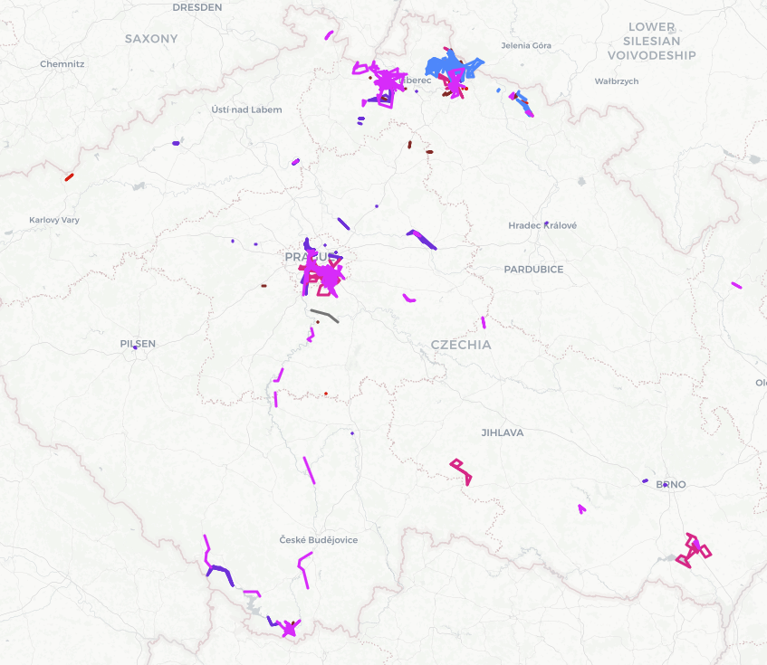
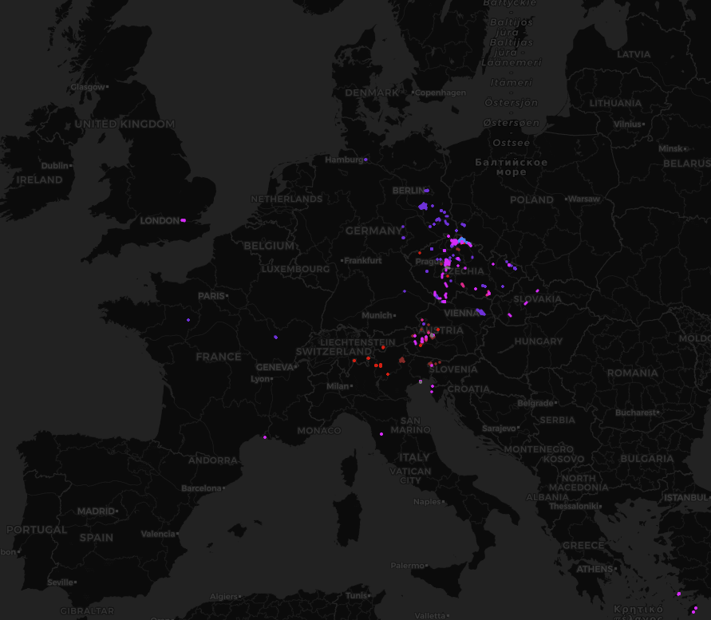
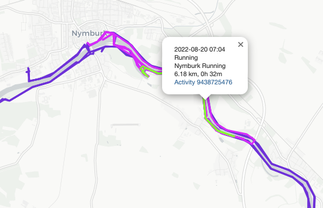
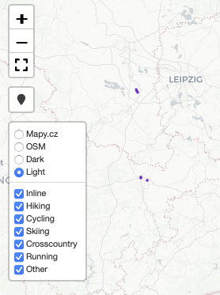

# Garmin Activities Map

Tool to render Garmin activities on a map. It downloads activities from Garmin Connect, stores them locally, generates an HTML file
with all the activities shown on an interactive map and optionally uploads it to an FTP site. It gives you an easy-to-understand overview of
where you were, which paths you visited and which are still waiting for you.

It is a tool not an application. A couple of steps are needed to make it work and some code adjustments may be required to match
your needs.

It should be useful primarily for people using Garmin Connect as the main repository of their activities. If you use Strava, I would recommend
to look into [StatsHunters](https://www.statshunters.com), which is a more mature and feature-rich application.


## What it produces

Example with a light background map:



Example with a dark background map:



Hovering over an activity highlights it. Clicking an activity opens a popup with basic information about the activity and a link to Garmin
Connect:



Map controls allow for selection of background map, selection of activity categories to show and for zooming in/out:



The rectangle button (in the top-left zoom toolbar) enables the area-selection tool: drag a box on
the map to list the activities inside it, with per-category and overall totals (distance, time,
count) and a toggle between counting tracks that are *fully* inside vs *partially* inside the box.
It only considers activities that are currently visible, so it respects the date-range slider and
the category selection — and while the box stays up, the list updates live as you move the slider
or toggle categories. Disable it with `enable-area-selection = false` under `[activities]` in your
config.


## How to get it working

* install Python 3
* get python dependencies from requirements.txt
* only if you want to upload resulting map to an FTP site
  * copy the [ftp] section from config-default.toml to config-local.toml and populate it with your personal values
  * set `protocol` to FTPS (the default) or FTP if your host does not support FTPS; plain FTP sends the password unencrypted
  * first put your password in plain-text there
  * run the tool while setting all the processors to OFF and setting utility-mode to ENCRYPT_FTP_PASSWORD
    * `python activities-map.py --downloader OFF --map-creator OFF --uploader OFF --utility-mode ENCRYPT_FTP_PASSWORD`
  * replace password in the config with the printed encrypted version
  * the first run generates a random key in `.auth/ftp.key` (git-ignored). Back it up together with
    config-local.toml; without it the password has to be encrypted again
* only if you want to use Mapy.com (formerly Mapy.cz) map tiles (useful mostly for tourist paths in Central Europe region):
  * go to https://developer.mapy.com/en/rest-api-mapy-cz/api-key/
  * generate your own API key
  * store the key in config-local.toml in [map-tiles] section as mapy-com-api-key
* only if you want to use CARTO map tiles (the "Dark", "Light" and "Voyager" backgrounds):
  * CARTO tiles require an API key since 2026 - without one they are served with an "API KEY REQUIRED" watermark
  * get a free key (5 million tile requests / month) at https://carto.com/basemaps/apikey/
  * store the key in config-local.toml in [map-tiles] section as carto-api-key
* on the first run you will be asked for your Garmin credentials. It will then generate an authentication token which will be persisted 
locally in .auth directory and will work for a year


## How to use it

* Adjust mode values in config-local.toml to reflect what you want to do
* Run activities-map.py
* Open the output `output/activities_map.html` or from your FTP site in your browser
* Next time only new activities will be downloaded and whole map will be regenerated


* If you need to customize behavior of the tool start by understanding config-default.toml and take it from there
* For automated or scheduled runs (e.g. cron) you can override the [mode] settings on the command
  line instead of editing config - anything not passed keeps its config value:
  * `python activities-map.py --downloader ON --map-creator ON --uploader ON`
  * `python activities-map.py --utility-mode RESORT_CSV`
  * run `python activities-map.py --help` to see all options


## How it works

The tool is broken down into a couple of files which represent sort of isolated functionality.

* activities-map.py - the main file, the central piece which controls the flow and invokes other files
* downloader.py - downloads data from Garmin Connect, reprocesses GPS coordinates of activities
* storage.py - manages local storage of activities data
* mapgenerator.py - creates a map and puts activities on it
* ftpuploader.py - uploads the map to an FTP site

There are two configuration files:
* config-default.toml - do not edit, contains default values and explanations of all the properties
* config-local.toml - put your personal config overrides here. This file is not under version control

See comments in individual files for more details. A deeper walkthrough of the
pipeline, data model and output formats is in [docs/architecture.md](docs/architecture.md).

Communication with Garmin Connect is based on [Python: Garmin Connect](https://github.com/cyberjunky/python-garminconnect) library.
Map generation is done via the [Folium](https://python-visualization.github.io/folium/latest/index.html) library, which creates code based
on the [Leaflet JS](https://leafletjs.com) library.

### Known limitations
Garmin does not allow to download GPX for long activities (e.g. over 3 hours). You will get
"too many 408 error responses" here and "This file is too large to export to GPX" when you try to
download from the web.
If it is just one activity or so, you can work around it with a couple of manual steps:
- download FIT file instead of GPX
- use some online converter to produce the GPX file, store it in data/gpx. Follow proper naming
- add the activity to data/activities_list.csv manually. Follow proper formatting
- use the utility mode to regenerate coordinates, adjust code just for this activity id. Search for
    REGENERATE_COORDINATES
- revert everything to BAU

## Testing

Tests live under `tests/` and run with [pytest](https://pytest.org):

```
pip install -r requirements-dev.txt
python -m pytest
```

Most tests are pure-Python and cover the download/storage/map-generation/upload
pipeline. Two modules — `tests/test_browser_mapy.py` and
`tests/test_browser_area_select.py` — are **browser tests**: they build a real
map, serve it, and drive it in headless Chromium with
[Playwright](https://playwright.dev/python/) to exercise the client-side
JavaScript in `templates/activity_loader_template.html` (the Mapy.com
attribution toggle and the area-selection tool). This is the only coverage the
JavaScript gets, so it matters that they actually run.

They are opt-in and **skip silently** unless both Playwright and a Chromium build
are present. To enable them:

```
pip install -r requirements-dev.txt
playwright install chromium
python -m pytest tests/test_browser_area_select.py tests/test_browser_mapy.py
```

To check coverage:

```
coverage run -m pytest && coverage report -m
```

(`coverage` measures the Python side only; the browser tests report their own
JS coverage indirectly by driving the page.)

## Contributing: keep personal data out

This repo is public, but your working copy holds personal data (`data/`,
`output/`, `.auth/`, `config-local.toml`). A pre-commit hook in `.githooks/`
rejects commits that contain those paths, GPS track files, tokens, encrypted
passwords, Garmin account fields, e-mail addresses, precise coordinates, or any
credential value from your `config-local.toml`. Enable it once per clone:

```
git config core.hooksPath .githooks
```

Add further private strings (your name, street…) to `.git/leak-guard-denylist`,
one per line. `python3 .githooks/leak_guard.py --all` audits every tracked file.
Test fixtures must use synthetic data: coordinates within 1° of (0, 0), with
Garmin owner fields set to `null`.

## Licensing and attribution

This tool is released under the [MIT license](LICENSE). The Python and JavaScript
libraries it builds on (Folium, Leaflet, noUiSlider, gpxpy, and so on) are all
under permissive licenses (MIT / BSD / Apache-2.0).

The generated map embeds third-party map tiles, and the providers' terms require
their attribution to stay visible. The tool renders these automatically - **do not
remove them**:

* **OpenStreetMap** - map data © OpenStreetMap contributors
  ([ODbL](https://www.openstreetmap.org/copyright)); shown in the map's attribution
  control. The built-in "OSM" background uses OpenStreetMap's own tile servers,
  which are fine for a personal, low-traffic map but are subject to the
  [OSM tile usage policy](https://operations.osmfoundation.org/policies/tiles/).
* **CARTO** (Dark/Light/Voyager backgrounds) - credited to CARTO and OpenStreetMap;
  requires your own CARTO API key (see above).
* **Mapy.com / Seznam.cz** (Mapy.com backgrounds, formerly Mapy.cz) - requires your
  own Mapy.com API key and, per
  [their terms](https://developer.mapy.com/rest-api-mapy-cz/atribution/), a visible,
  clickable Mapy.com logo (at least 30 px high) plus the "Seznam.cz a.s. and others"
  copyright while a Mapy.com layer is active. The logo sits in the bottom-right corner
  just above the map's attribution control, which carries the copyright; both are
  rendered automatically and shown only when a Mapy.com background is selected.

## Links

* [Python: Garmin Connect](https://github.com/cyberjunky/python-garminconnect) - use Garmin Connect REST API from Python
* [Garth](https://github.com/matin/garth) - lower level library for Garmin Connect API
* [Folium](https://python-visualization.github.io/folium/latest/index.html) - map generator for Python
* [Leaflet JS](https://leafletjs.com) - JavaScript library for maps
* https://www.fitfileviewer.com - web FIT viewer
* https://gpx.studio - web GPX viewer


* related projects:
  * https://github.com/tcgoetz/GarminDB - local database with Garmin activities
  * https://github.com/pe-st/garmin-connect-export
  * https://github.com/danmarg/export_garmin
  * [StatsHunters](https://www.statshunters.com) - application serving similar purpose but for Strava
* working with FIT files:
  * https://fitdecode.readthedocs.io/en/latest/index.html
  * https://github.com/polyvertex/fitdecode
* how to visualize activities:
  * https://medium.com/@azholud/analysis-and-visualization-of-activities-from-garmin-connect-b3e021c62472
  * https://medium.com/@vinodvidhole/interesting-heatmaps-using-python-folium-ee41b118a996


## Ideas, todos

* mobile: picking an activity is fiddly, it often takes several taps to hit the line
* mobile: the rectangle (area) selection seems unusable, or at least there is no obvious way to use it
* is the "tap to reload" button needed, or can the reload happen automatically?
* overlapping activities: many activities repeat the same track or overlap a lot, so a click/tap
  rarely picks the one you want. The click/tap could instead list all activities whose lines pass
  through a small area around that point, so you can pick one (like the rectangle selection, but
  for a point)
* time-range filter presets: this year, last year, this month, last month…, plus calendar
  pickers for easier precise selection
* garth decommissioning: `garth` (Garmin Connect auth, used via `garminconnect`) is being
  retired, so the login needs to move to whatever replaces it
