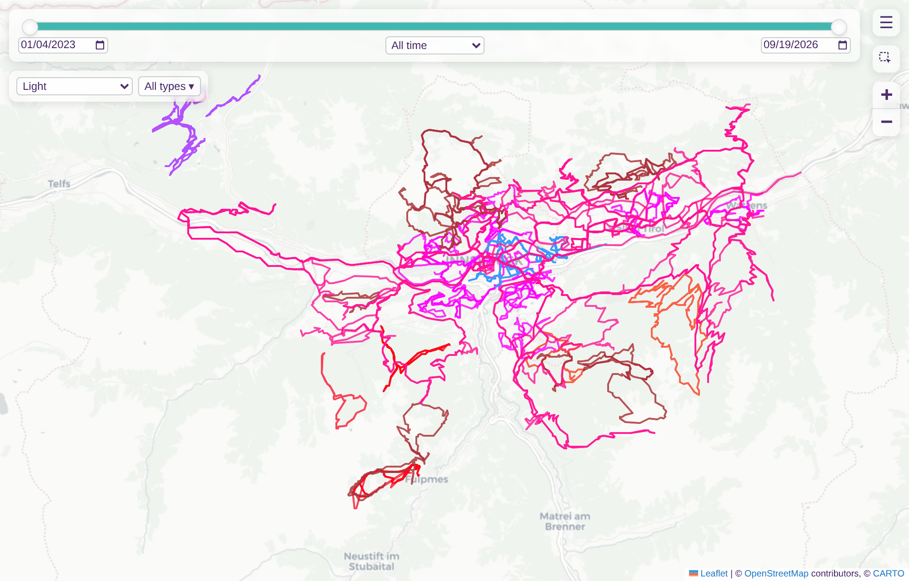
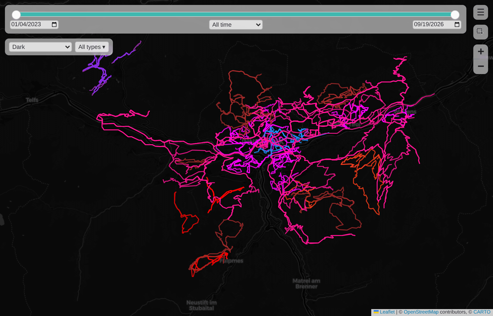
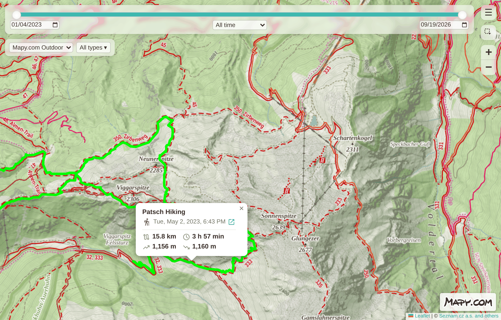
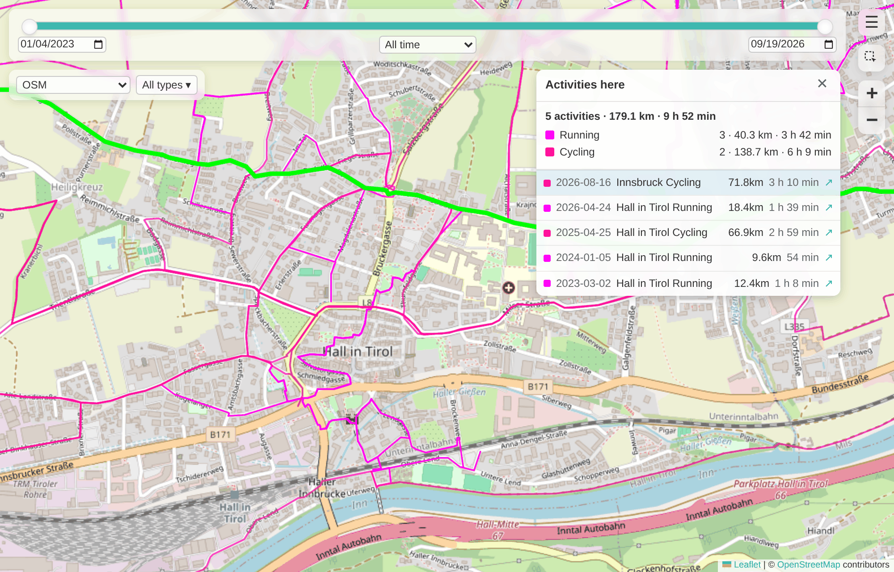
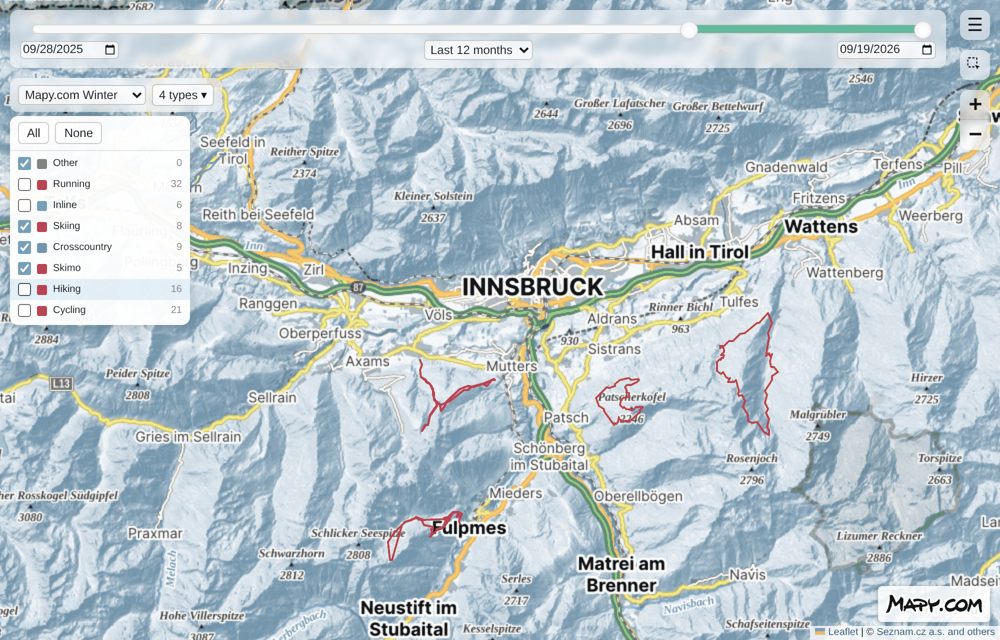
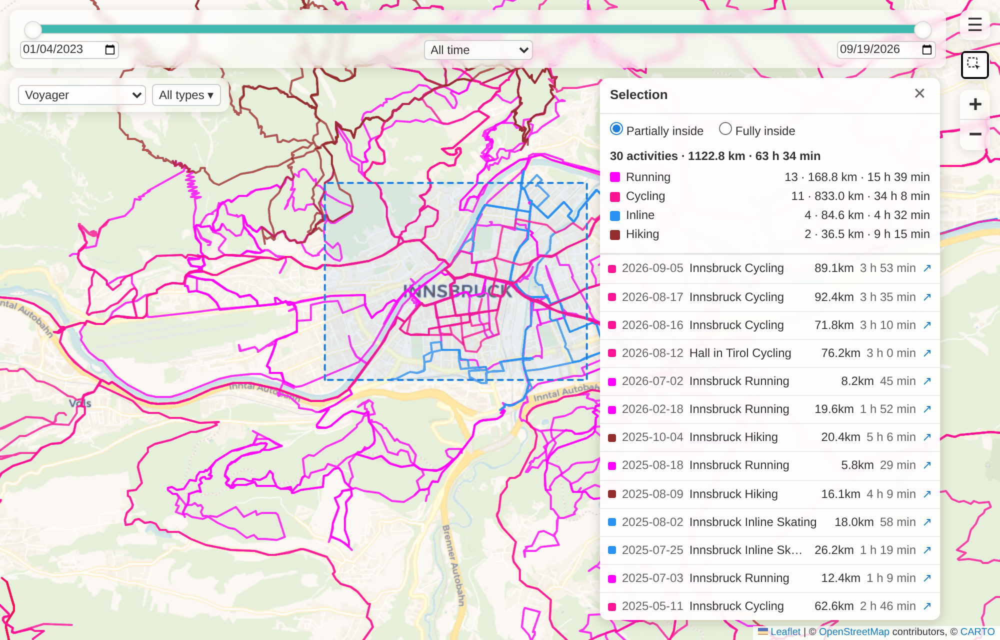

# Garmin Activities Map

Garmin Activities Map is a Python command-line tool that turns your Garmin Connect history into an interactive web map of
every route you have run, ridden, hiked or skied. It downloads your activities, keeps a
local copy of them, and generates a map you can open in a browser or publish on your own
website. At a glance you see where you have been, which trails you have already covered
and which are still waiting for you.



<sub>All screenshots show synthetic demo activities.</sub>

## Features

- **Incremental sync with Garmin Connect.** Each run downloads only new activities and
  keeps a complete local archive: the original GPX track and the full activity data.
- **A fast, lightweight map.** Tracks are simplified and split into one data file per
  activity category, and each category loads only when it is shown, so even thousands
  of activities stay responsive.
- **Several background maps.** OpenStreetMap, CARTO (Light, Dark, Voyager) and
  Mapy.com (Outdoor, Winter), or any other tile source supported by Folium.
- **Filters.** Show only the activities in a date range or only the activity types you
  are interested in.
- **Activity details.** A popup shows each activity's date, distance, duration, ascent
  and descent, with a link to Garmin Connect.
- **Selection tools.** Click where tracks overlap to list them, or draw a rectangle to
  list and total everything inside it.
- **Comparison.** Two maps side by side, each with its own date range, e.g. to compare
  two years.
- **Works on desktop and mobile.** Mouse and touch input are both supported.
- **Publishing.** The map is a set of static files that can be uploaded to any web host
  over FTPS, incrementally.
- **Scheduling.** Every step can be turned on or off from the command line, so the tool
  can run unattended, e.g. from cron.

### Background maps

Pick the background that suits the map best: a clean light or dark basemap for an
overview, or a detailed outdoor map when exploring trails.

<p>
  
  
</p>

### Activity details

Hovering over a track highlights it and shows which way it went: small arrows along the
line, a green ▶ marker at the start and a chequered one at the finish (a single split
marker when the activity ends where it started). Repeated laps get one set of arrows. While a popup is open, hovering over other tracks doesn't highlight them. Clicking it opens a popup with the activity name
and type, start date and time, distance, duration, total ascent and descent (when Garmin
recorded them) and a link to the activity in Garmin Connect. The popup can be dragged
aside by its title when it covers part of the map.

A click does not need to hit the thin line exactly: anything within a few pixels counts
(about 6 px with a mouse, 20 px with a finger). Where several tracks pass through the
clicked spot, they are listed so you can pick one. Hovering over a row highlights its
track.



### Filtering by date and activity type

The panel along the top filters activities by date. Drag the slider, choose a preset
(all time, last 30 days, last 12 months, this or last month, this or last year, or any
single year), or enter exact dates. The browser remembers the last preset you picked, so
a relative one such as "This year" moves with the calendar.

The drop-down under it selects the activity types to show, with the number of activities
of each type. The one beside it selects the background map; **No map** shows the tracks
alone on white.



### Area selection

The rectangle button in the top-right corner turns on area selection. Drag a box on the
map (with the mouse, or one finger on a touch screen) to list the activities inside it,
with totals of distance, time and count per category and overall. Drag the handles on
its corners and sides to resize it; the list follows as you drag. You can count tracks
that are fully inside the box or just pass through it. **Zoom to selection** fits the
box to the screen, with a little room around it. Only the activities currently
shown are counted, and the list updates live as you change the filters. Area selection
can be turned off with `enable-area-selection = false` under `[activities]`.



### Saving an image

The camera button in the top-right corner saves the map as a PNG with more detail than
the screen shows. The image is drawn again at a higher zoom, as if you zoomed in, took
several screenshots and joined them. It carries the map provider's credit, which their
terms require.

It saves the area selection (its dialog also has a **Save as image…** button), or the
whole view when nothing is selected. Choose the detail (2×, 4×, … up to the map's highest
zoom). The image shows what the map shows now: the background map, the date and type
filters, the display settings and any highlighted track with its direction. Lines and
markers keep their screen width, so they look thinner at more detail; tick **Enlarge
lines with the image** to get an enlargement of the screen instead.

With **No map** as the background map, the image has only the tracks on a transparent
background, so images of the same area and zoom can be laid over each other, e.g. one per
year in an image editor. No map tiles are downloaded, so it can go past the map's highest
zoom. Such files get `-transparent` in their name.

Limits and caveats:

- The map tiles are downloaded again at the chosen zoom, at most 400 per image. Mapy.com
  counts them against your API key's quota like any other tiles.
- The image size is limited to 50 megapixels (16 on phones and tablets). Larger choices
  are shown as "too large", and generating the map warns about a preset selection over
  the limits. An image with no map has no tiles, so only the size limit applies.
- Tracks are stored simplified (`coords-simplification-factor`), so from about zoom 15
  they show straight segments while the background map keeps getting sharper.
- A preset gives the same area every time, but the background map changes as its
  provider updates it.

### Presets

The bookmark button in the top-right corner lists your presets: named states of the map.
Applying one sets what the preset has (the view, area selection, date range, activity
types, background map or display settings) and leaves the rest as it is. The panel then
closes, and a preset's selection shows its list and totals. A preset with
only a date range switches the year and keeps the view; one with a view and a selection
goes straight to a place.

A preset with a selection and an `image-zoom` makes images of a place comparable over
time, e.g. a yearly image of your city: apply it, then save the image. The file is named
after the preset, e.g. `prague-2026-09-30-z13.png`.

Presets are defined in `config-local.toml`. Under **New preset from the current state**
in the panel, tick the parts to keep and press **Copy as preset** for a ready entry;
paste it, give it a name and generate the map again.

```toml
[[presets]]
name = "Prague this year"
# Every key below is optional; the map keeps what a preset leaves out.
center = [50.08, 14.44]                      # the view
zoom = 12
selection = [[49.94, 14.22], [50.18, 14.71]] # [[south, west], [north, east]]
image-zoom = 13                              # detail "Save image" saves the selection at
date-range = "this-year"   # or "all", "last-12-months", "year-2024", ["2024-01-01", "2024-06-30"], ...
types = ["Running", "Cycling"]
tiles = "OSM"              # or "No map"
map-opacity = 60           # percent, 20 to 100
line-width = 3             # px, 1 to 5
thin-lines = false
show-direction = true
```

A selection is brought into view when the preset sets no `center` or `zoom`. Setting
`line-width` and `map-opacity` in a preset makes its images the same whatever the
display settings were before. Presets from the earlier `[[image-presets]]` are reported
when the map is generated: rename the section to `[[presets]]`, `bounds` to `selection`
and `zoom` to `image-zoom`.

### Display settings

The gear button under the camera button opens the display settings. Use them
when tracks are hard to see on a busy map, such as Mapy.com Outdoor with its coloured
trails:

- **Line width** sets how wide the tracks are drawn, from 1 to 5 px.
- **Thin, see-through lines** draws the tracks thinner and partly transparent. Where
  tracks overlap they add up, so the paths you use most show strongest, like a heatmap.
- **Map opacity** fades the map, down to 20 %, so the tracks stand out.
- **Show direction** turns the arrows and start/finish markers on a highlighted track
  on or off.

The browser remembers these settings, and the rest of the map too: on a reload you get
the view, background map, activity types, area selection and time range you left (a
hand-picked date range is not kept, so new activities don't stay hidden). **Reset to
defaults** at the bottom of the dialog forgets all of it and opens the map as configured.

### Comparing two date ranges

The button with two panes, under the gear button, splits the page into two maps side by
side (one above the other on a phone held upright), e.g. to compare this year with last
year. Both start with the current date range; change either one's dates on its own panel.
Everything else is shared: the view, the activity types, the background map, the display
settings and the area selection. The first map has all the controls; the second has only
its date panel, but you can pan and zoom either one and the other follows.

A selection shows on both maps, each with its list and totals for its own dates. Presets
apply to the first map, and a preset's date range changes only the first map's dates.
The same button, highlighted while comparing, goes back to a single map with the first
map's settings.

Each map loads its own copy of the activity data, so comparing needs about twice the
memory. Each map also requests its own tiles; the browser's cache usually serves the
second map's tiles, unless the tile server forbids caching.

## Getting started

### Requirements

- Python 3.12 or newer
- A Garmin Connect account
- Optional: API keys for CARTO and Mapy.com background maps
- Optional: a web host with FTPS (or FTP) access, to publish the map

### Installation

```
git clone https://github.com/MareenCZE/garmin-activities-map.git
cd garmin-activities-map
python -m venv venv
source venv/bin/activate        # on Windows: venv\Scripts\activate
pip install -r requirements.txt
```

### Configuration

All settings live in two TOML files:

- `config-default.toml` documents every setting with its default value. Do not edit it.
- `config-local.toml` (create it; it is git-ignored) holds your personal values and
  overrides. It only needs the keys you want to change.

The sections below cover the settings most people change.

#### Garmin Connect

No configuration is needed. On the first run you are asked for your Garmin Connect
e-mail, password and, if enabled, an MFA code. The resulting login token is stored in
`.auth/garmin_tokens.json` and renews itself on later runs, so you are asked again only
if Garmin revokes it.

#### Background maps

OpenStreetMap works without any setup. CARTO and Mapy.com need a free API key each; add
them to the `[map-tiles]` section of `config-local.toml`:

```toml
[map-tiles]
carto-api-key = "your CARTO key"
mapy-com-api-key = "your Mapy.com key"
```

- **CARTO** (Light, Dark and Voyager): get a key at
  <https://carto.com/basemaps/apikey/> (5 million tile requests a month are free).
  Without a key the tiles carry an "API KEY REQUIRED" watermark.
- **Mapy.com** (formerly Mapy.cz; detailed outdoor and winter maps, strongest in
  Central Europe): get a key at <https://developer.mapy.com/en/rest-api-mapy-cz/api-key/>.
  Without a key, the Mapy.com backgrounds are left out.

The `tiles` list in the same section controls which backgrounds are offered and in what
order.

#### Activity categories

`[activities].mapping` groups Garmin activity types into categories, each with its own
colour, and `display-mapping-on-load` sets the categories shown when the page opens.
Activity types that match no category go into "Other". A type's key (e.g.
`trail_running`) can be found in the activity's JSON file under `data/json/`.

#### Publishing via FTP

1. Copy the `[ftp]` section from `config-default.toml` to `config-local.toml` and fill
   in your host, user, remote path and file name. Put the password in as plain text for
   now.
2. Keep `protocol = "FTPS"` unless your host does not support it. Plain FTP sends the
   password unencrypted.
3. Encrypt the password:

   ```
   python activities-map.py --downloader OFF --map-creator OFF --uploader OFF --utility-mode ENCRYPT_FTP_PASSWORD
   ```

4. Replace the plain-text password in `config-local.toml` with the printed encrypted
   value.

The first encryption generates a random key in `.auth/ftp.key`. Back it up together
with `config-local.toml`; without it the password has to be encrypted again.

## Usage

```
python activities-map.py
```

With the default configuration, a run downloads new activities, generates the map and
uploads it. Open `output/activities_map.html` in a browser, or the published page on
your site. Later runs download only activities added since the previous run.

### Command-line options

Command-line options override the `[mode]` section of the config for a single run.
This is convenient for scheduled runs:

```
python activities-map.py --downloader ON --map-creator ON --uploader ON
python activities-map.py --uploader OFF
python activities-map.py --help
```

### Maintenance operations

The `--utility-mode` option (or `utility-mode` in `[mode]`) runs a one-off operation:

| Mode                     | Purpose                                                              |
|--------------------------|----------------------------------------------------------------------|
| `REDOWNLOAD`             | Download one activity again; pass its ID with `--activity-id`.       |
| `REGENERATE_COORDINATES` | Rebuild the map coordinates from the stored GPX files, e.g. after changing the precision settings. |
| `REGENERATE_CSV`         | Rebuild the activity index from the stored JSON files.               |
| `RESORT_CSV`             | Sort the activity index by date.                                     |
| `ENCRYPT_FTP_PASSWORD`   | Encrypt the FTP password (see above).                                |

## How it works

The application is a pipeline of small modules:

- `activities-map.py` is the entry point. It reads the configuration and runs the
  enabled stages.
- `downloader.py` fetches activities from Garmin Connect and prepares the track data.
- `storage.py` manages the local archive in `data/`, with `data/activities_list.csv`
  as its index.
- `mapgenerator.py` generates `output/activities_map.html` and its data files in
  `output/data/`.
- `ftpuploader.py` publishes the output to your web host.

The interactive behaviour of the map is implemented in
`templates/activity_loader_template.html`. For the data formats, the generated files
and the client-side design, see [docs/architecture.md](docs/architecture.md).

The project builds on [python-garminconnect](https://github.com/cyberjunky/python-garminconnect)
for Garmin Connect access, [Folium](https://python-visualization.github.io/folium/latest/)
for map generation and [Leaflet](https://leafletjs.com) for the map in the browser.

### Known limitations

- **Very long activities.** Garmin Connect does not export GPX for very long activities
  (roughly over 3 hours). The download then fails with "too many 408 error responses",
  and the Garmin Connect website reports "This file is too large to export to GPX". To
  add such an activity by hand:
  1. Download its FIT file from Garmin Connect and convert it to GPX with an online
     converter.
  2. Save the GPX in `data/gpx/` and add the activity's row to
     `data/activities_list.csv`, following the naming and format of the existing
     entries.
  3. Run the `REGENERATE_COORDINATES` utility mode to create its coordinate file.
- **Upload change detection.** Incremental upload compares file sizes, so a data file
  that changes without changing its size is not re-uploaded.

## Testing

Tests live in `tests/` and run with [pytest](https://pytest.org):

```
pip install -r requirements-dev.txt
python -m pytest
```

Most tests are plain Python and cover the whole pipeline with Garmin Connect and FTP
mocked. The `tests/test_browser_*.py` modules build a real map, serve it locally and
drive it in headless Chromium with [Playwright](https://playwright.dev/python/). They
are the only tests of the map's JavaScript. They skip unless Playwright and its Chromium
build are installed, and pytest then ends with a warning saying what is missing:

```
playwright install chromium
python -m pytest tests/test_browser_*.py
```

For Python coverage, run `coverage run -m pytest && coverage report -m`. More details
are in [tests/README.md](tests/README.md).

## Contributing: keep personal data out

This repository is public, but a working copy holds personal data (`data/`, `output/`,
`.auth/`, `config-local.toml`). A pre-commit hook in `.githooks/` rejects commits that
contain those paths, GPS track files, tokens, encrypted passwords, Garmin account
fields, e-mail addresses, precise coordinates, or any credential value from your
`config-local.toml`. Enable it once per clone:

```
git config core.hooksPath .githooks
```

Add further private strings (your name, street, …) to `.git/leak-guard-denylist`, one
per line. `python3 .githooks/leak_guard.py --all` audits every tracked file. Test
fixtures must use synthetic data: coordinates within 1° of (0, 0), with Garmin owner
fields set to `null`.

## Licensing and attribution

Garmin Activities Map is released under the [MIT license](LICENSE). The Python and
JavaScript libraries it builds on (Folium, Leaflet, noUiSlider, gpxpy and others) use
permissive licenses (MIT, BSD, Apache-2.0).

The generated map displays third-party map tiles, and the providers' terms require
their attribution to stay visible. The map adds it automatically. **Do not remove it.**

- **OpenStreetMap:** map data © OpenStreetMap contributors
  ([ODbL](https://www.openstreetmap.org/copyright)), shown in the map's attribution
  control. The "OSM" background uses OpenStreetMap's own tile servers. That is fine for
  a personal, low-traffic map, but it is subject to the
  [OSM tile usage policy](https://operations.osmfoundation.org/policies/tiles/).
- **CARTO** (Light, Dark and Voyager backgrounds): credited to CARTO and OpenStreetMap.
  Requires your own CARTO API key.
- **Mapy.com / Seznam.cz** (Mapy.com backgrounds): requires your own Mapy.com API key.
  [Their terms](https://developer.mapy.com/rest-api-mapy-cz/atribution/) also require a
  visible, clickable Mapy.com logo (at least 30 px high) plus the "Seznam.cz a.s. and
  others" copyright while a Mapy.com layer is shown. The map shows both automatically
  when a Mapy.com background is selected: the logo in the bottom-right corner, the
  copyright in the attribution control.

## Related projects

- [python-garminconnect](https://github.com/cyberjunky/python-garminconnect): Garmin
  Connect API for Python
- [Folium](https://python-visualization.github.io/folium/latest/): Leaflet maps from
  Python
- [Leaflet](https://leafletjs.com): JavaScript library for interactive maps
- [StatsHunters](https://www.statshunters.com): a similar service for Strava users
- [GarminDB](https://github.com/tcgoetz/GarminDB): a local database of Garmin data
- [garmin-connect-export](https://github.com/pe-st/garmin-connect-export) and
  [export_garmin](https://github.com/danmarg/export_garmin): Garmin Connect exporters
- [fitdecode](https://github.com/polyvertex/fitdecode)
  ([docs](https://fitdecode.readthedocs.io/en/latest/index.html)): FIT file decoding
- [FIT File Viewer](https://www.fitfileviewer.com) and [gpx.studio](https://gpx.studio):
  online FIT and GPX viewers
- Articles on visualizing activities:
  [Analysis and visualization of activities from Garmin Connect](https://medium.com/@azholud/analysis-and-visualization-of-activities-from-garmin-connect-b3e021c62472),
  [Interesting heatmaps using Python Folium](https://medium.com/@vinodvidhole/interesting-heatmaps-using-python-folium-ee41b118a996)

## Roadmap

- **Installer.** Replace the manual installation steps in this README (venv,
  `pip install`, first configuration) with an installer script.
